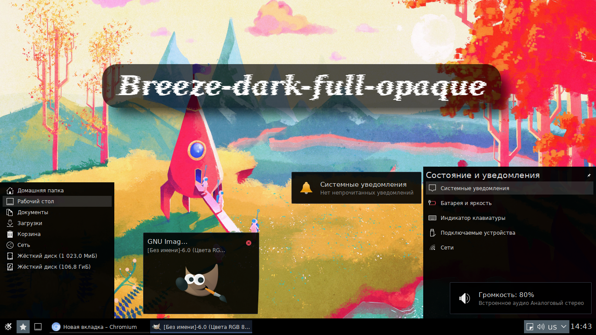

# Breeze dark opaque - Desktop theme

**Source Code:** https://github.com/Koi-foo/breeze-dark-opaque

## Summary:
Kde5 Desktop Theme

## Description:
Breeze dark opaque - Desktop theme.
Breeze dark full opaque - Desktop theme.
Icons - Breeze dark ( mix )
Color theme - Breeze dark ( mix )
Color correction - 1.00

As the brightness is shifted down, the colors become more contrasting. (Recommended for light backgrounds)
The panel theme works well with the "Breeze classic" window design by setting the active window title to black.

Panel background - ~ / .local / share / kf5 / plasma / desktoptheme / Breeze-dark-opaque / widgets / panel-background.svg
Transparency - 0%

Dialog background - ~ / .local / share / kf5 / plasma / desktoptheme / Breeze-dark-opaque / dialogs / background.svgz
Transparency - 5%

Tooltip background - ~ / .local / share / kf5 / plasma / desktoptheme / Breeze-dark-opaque / widgets / tooltip.svgz
Transparency - 10%

Widget background - ~ / .local / share / kf5 / plasma / desktoptheme / Breeze-dark-opaque / widgets / background.svg
Transparency - 5%

Win10 icon - ~ / .local / share / kf5 / plasma / desktoptheme / Breeze-dark-opaque / icons / win10.svg

KDE icon ( dark theme ) - ~ / .local / share / kf5 / plasma / desktoptheme / Breeze-dark-opaque / icons / kde.svg

## License: 
GPLv3

## Discussions
[Forum altlinux](https://forum.altlinux.org/index.php?topic=44275.0)

## Install
Installation via [store.kde.org](https://store.kde.org/p/1424368)

## Changelog
* New version v1.3

## Preview

  

